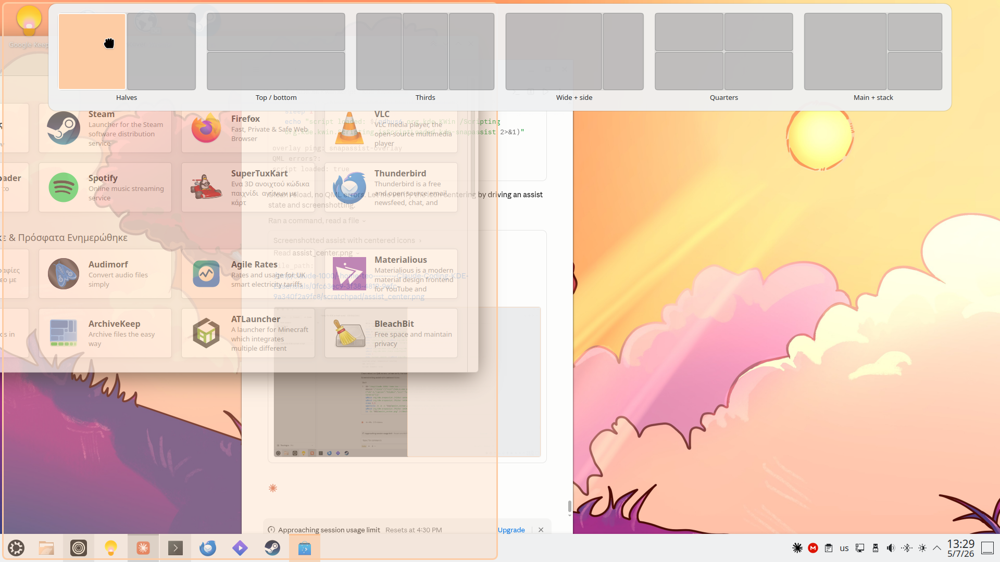
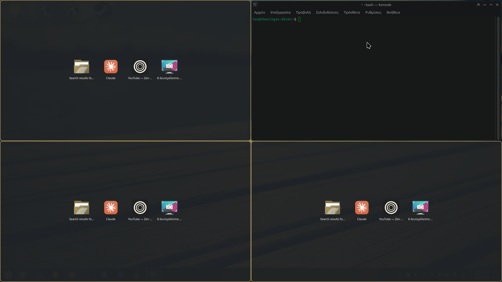
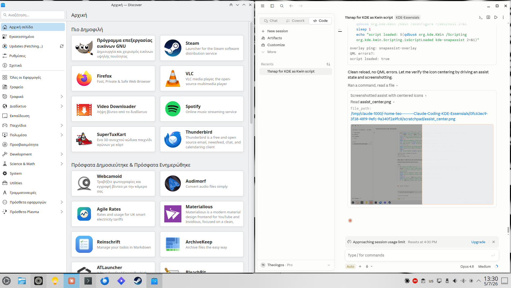

# KDE Snap Assist

Windows 11-style **snap layouts** and **Snap Assist** for **KDE Plasma 6**
(KWin 6, Wayland) — built as a KWin script that rides on **KDE's own tiling
engine** rather than reimplementing window management.

Drag a window to the top edge, pick a layout, drop it — then fill the rest of
the layout from a grid of your other open windows. It's a port of
[11snap](https://github.com/kalotrapezis) (Cinnamon/X11) to KDE.

## Screenshots

| Snap picker | Snap Assist |
|---|---|
|  |  |



## Features

- **Drag to the top edge** → a picker of 6 layout templates: Halves, Top/bottom,
  Thirds, Wide + side, Quarters, Main + stack.
- **Live preview** of exactly where the window will land as you hover the zones.
- **Snap Assist** — after placing the first window, the layout's empty tiles show
  your other open windows (minimized ones too); click one to fill the tile.
- Uses **KDE's real tiling** under the hood — tile-group resize, Wayland-correct
  geometry, no shadow-math hacks.
- Overlay follows your **Plasma accent + light/dark** theme and sits on a solid
  panel so it's readable on any wallpaper.

## Requirements

- KDE Plasma 6 / KWin 6 on **Wayland**
- `python3-pyqt6` and `qml6-module-org-kde-layershell`

```bash
sudo apt install python3-pyqt6 qml6-module-org-kde-layershell
```

## Install

```bash
git clone https://github.com/kalotrapezis/KDE-Essensianls.git
cd KDE-Essensianls/KDE-SnapAssist
./install.sh
```

This installs the KWin script, the overlay app, and a **login autostart** entry
(all under `~/.local`, no root). Drag a window to the top edge to try it.

Uninstall:

```bash
./install.sh --uninstall
```

## Usage

- **Snap**: drag a window's titlebar toward the top edge → the picker appears →
  move over a zone (preview follows) → drop to snap.
- **Snap Assist**: right after snapping, click any offered window to drop it into
  an empty tile. Click empty space or press **Esc** to dismiss.
- The picker also closes on a left-click or automatically if a drag is
  interrupted.

---

## How it works

```
picker (QML overlay)  ──pick──▶  reshape KWin tile tree  ──assign──▶  KWin tiles the window
```

A KWin script can't draw, so the UI is a small companion process bridged over
D-Bus:

- **`contents/code/main.js`** — the resident KWin script: drag/trigger handling,
  template → tile-tree translation, `window.tile =` assignment, Snap Assist
  logic. Talks to the overlay via `callDBus`.
- **`overlay/overlay.py`** — PyQt6 host + D-Bus service (`org.kde.snapassist`),
  resolves app icons from `.desktop` files. Run `python3 overlay.py --demo` to
  preview the picker.
- **`overlay/Picker.qml`** / **`overlay/Assist.qml`** — fullscreen LayerShell
  overlays, themed from Kirigami/Plasma.

Templates are stored as guillotine trees that map 1:1 onto KWin's per-screen
tile tree, so picking one reshapes the live tree; KDE then owns the snapping.

### Notes for hackers

The `docs`-worthy KWin 6.6 findings this was built on:

- `workspace.tilingForScreen(screen).rootTile`; `Tile` has `split(dir)`,
  `remove()`, `resizeByPixels(delta, edge)`, `absoluteGeometry`, `windows`.
- `layoutDirection`: 1 = horizontal, 2 = vertical. `resizeByPixels` edge is
  **Qt::Edge** (RIGHT = 4, BOTTOM = 8).
- `split(dir)` on a **child** whose dir matches the parent adds one sibling;
  never re-split the root (it doubles the tree). Set proportions afterward by
  moving each boundary with `resizeByPixels`.
- Editing `kwinrc` + `reconfigure` does **not** reload tiling live — the
  in-memory `TileManager` is authoritative, so we shape the tree via the API.
- The KWin script engine has no `Qt`/QML; the overlay is a PyQt6 process, and
  the LayerShellQt QML plugin self-enables layer-shell on import.

## Development

```bash
./dev-install.sh          # install from the working tree + restart overlay + reload
./dev-install.sh --watch  # follow the [snapassist] journal + overlay stdout
./dev-install.sh --stop
```

## Roadmap

- Visual layout editor (custom templates)
- Snapshot/restore of the user's own `Meta+T` layout
- Multi-monitor polish

## License

[GNU GPL-3.0](../LICENSE)
